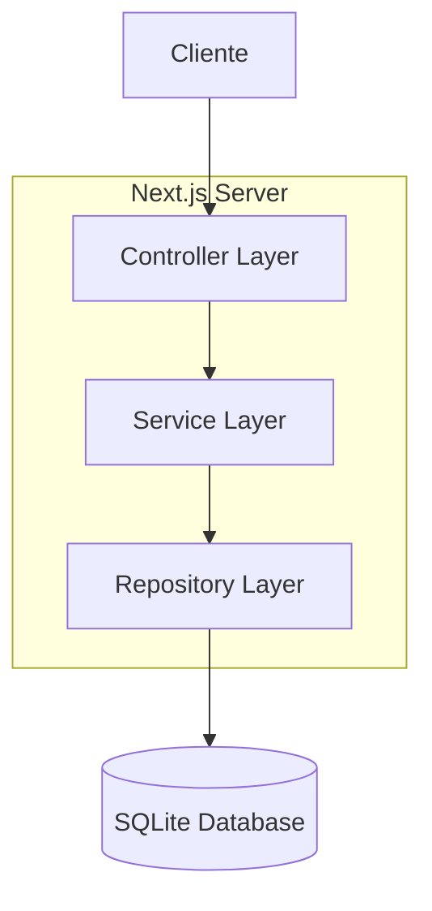
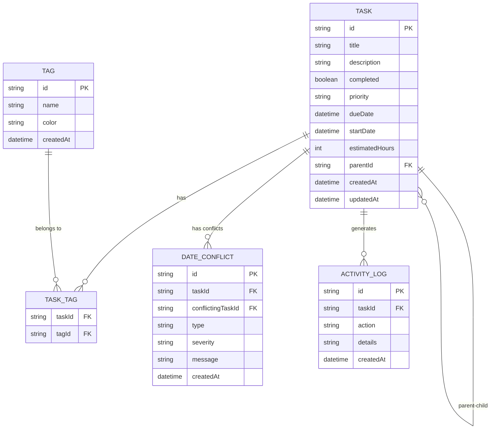

# TaskMaster 1.5 - Arquitectura Técnica

## 1. Arquitectura de Diseño

```mermaid
graph TD
    A[Usuario] --> B[React Frontend]
    B --> C[Next.js API Routes]
    C --> D[Prisma ORM]
    D --> E[SQLite Database]
    
    subgraph "Frontend Layer"
        B
        F[React Components]
        G[TypeScript Types]
        H[Tailwind CSS]
    end
    
    subgraph "Backend Layer"
        C
        I[API Handlers]
        J[Business Logic]
    end
    
    subgraph "Data Layer"
        D
        E
        K[Database Schema]
    end
end
```

## 2. Descripción de Tecnologías

- **Frontend**: React@18 + Next.js@15 + TypeScript@5 + Tailwind CSS@3
- **Backend**: Next.js API Routes + Prisma ORM@5
- **Base de Datos**: SQLite (desarrollo) / PostgreSQL (producción)
- **Herramientas**: ESLint + Prettier + Husky

## 3. Definición de Rutas

| Ruta | Propósito |
|------|----------|
| `/` | Página principal con lista de tareas |
| `/task/[id]` | Vista detallada de tarea individual |
| `/calendar` | Vista de calendario con tareas programadas |
| `/tags` | Gestión de etiquetas |
| `/settings` | Configuraciones de la aplicación |

## 4. Definiciones de API

### 4.1 APIs Core

**Gestión de Tareas**
```
GET /api/tasks - Obtener todas las tareas
POST /api/tasks - Crear nueva tarea
GET /api/tasks/[id] - Obtener tarea específica
PUT /api/tasks/[id] - Actualizar tarea
DELETE /api/tasks/[id] - Eliminar tarea
```

**Gestión de Tags**
```
GET /api/tags - Obtener todos los tags
POST /api/tags - Crear nuevo tag
PUT /api/tags/[id] - Actualizar tag
DELETE /api/tags/[id] - Eliminar tag
```

**Detección de Conflictos**
```
POST /api/conflicts/check - Verificar conflictos de fechas
GET /api/conflicts - Obtener conflictos existentes
```

### 4.2 Tipos TypeScript

```typescript
interface Task {
  id: string;
  title: string;
  description?: string;
  completed: boolean;
  priority: 'LOW' | 'MEDIUM' | 'HIGH' | 'URGENT';
  dueDate?: Date;
  startDate?: Date;
  estimatedHours?: number;
  parentId?: string;
  tags: Tag[];
  subtasks: Task[];
  createdAt: Date;
  updatedAt: Date;
}

interface Tag {
  id: string;
  name: string;
  color: string;
  createdAt: Date;
}

interface DateConflict {
  id: string;
  taskId: string;
  conflictingTaskId: string;
  type: 'OVERLAP' | 'OVERLOAD';
  severity: 'LOW' | 'MEDIUM' | 'HIGH';
  message: string;
  createdAt: Date;
}
```

## 5. Arquitectura del Servidor



## 6. Modelo de Datos

### 6.1 Definición del Modelo de Datos



### 6.2 Lenguaje de Definición de Datos (DDL)

```sql
-- Tabla de Tareas
CREATE TABLE tasks (
    id TEXT PRIMARY KEY DEFAULT (lower(hex(randomblob(16)))),
    title TEXT NOT NULL,
    description TEXT,
    completed BOOLEAN DEFAULT FALSE,
    priority TEXT CHECK (priority IN ('LOW', 'MEDIUM', 'HIGH', 'URGENT')) DEFAULT 'MEDIUM',
    due_date DATETIME,
    start_date DATETIME,
    estimated_hours INTEGER,
    parent_id TEXT,
    created_at DATETIME DEFAULT CURRENT_TIMESTAMP,
    updated_at DATETIME DEFAULT CURRENT_TIMESTAMP,
    FOREIGN KEY (parent_id) REFERENCES tasks(id) ON DELETE CASCADE
);

-- Tabla de Tags
CREATE TABLE tags (
    id TEXT PRIMARY KEY DEFAULT (lower(hex(randomblob(16)))),
    name TEXT UNIQUE NOT NULL,
    color TEXT NOT NULL DEFAULT '#3B82F6',
    created_at DATETIME DEFAULT CURRENT_TIMESTAMP
);

-- Tabla de relación Tarea-Tag
CREATE TABLE task_tags (
    task_id TEXT NOT NULL,
    tag_id TEXT NOT NULL,
    PRIMARY KEY (task_id, tag_id),
    FOREIGN KEY (task_id) REFERENCES tasks(id) ON DELETE CASCADE,
    FOREIGN KEY (tag_id) REFERENCES tags(id) ON DELETE CASCADE
);

-- Tabla de Conflictos de Fechas
CREATE TABLE date_conflicts (
    id TEXT PRIMARY KEY DEFAULT (lower(hex(randomblob(16)))),
    task_id TEXT NOT NULL,
    conflicting_task_id TEXT NOT NULL,
    type TEXT CHECK (type IN ('OVERLAP', 'OVERLOAD')) NOT NULL,
    severity TEXT CHECK (severity IN ('LOW', 'MEDIUM', 'HIGH')) DEFAULT 'MEDIUM',
    message TEXT NOT NULL,
    created_at DATETIME DEFAULT CURRENT_TIMESTAMP,
    FOREIGN KEY (task_id) REFERENCES tasks(id) ON DELETE CASCADE,
    FOREIGN KEY (conflicting_task_id) REFERENCES tasks(id) ON DELETE CASCADE
);

-- Tabla de Logs de Actividad (Fase 3)
CREATE TABLE activity_logs (
    id TEXT PRIMARY KEY DEFAULT (lower(hex(randomblob(16)))),
    task_id TEXT NOT NULL,
    action TEXT NOT NULL,
    details TEXT,
    created_at DATETIME DEFAULT CURRENT_TIMESTAMP,
    FOREIGN KEY (task_id) REFERENCES tasks(id) ON DELETE CASCADE
);

-- Índices para optimización
CREATE INDEX idx_tasks_parent_id ON tasks(parent_id);
CREATE INDEX idx_tasks_due_date ON tasks(due_date);
CREATE INDEX idx_tasks_priority ON tasks(priority);
CREATE INDEX idx_task_tags_task_id ON task_tags(task_id);
CREATE INDEX idx_task_tags_tag_id ON task_tags(tag_id);
CREATE INDEX idx_date_conflicts_task_id ON date_conflicts(task_id);
CREATE INDEX idx_activity_logs_task_id ON activity_logs(task_id);
CREATE INDEX idx_activity_logs_created_at ON activity_logs(created_at DESC);

-- Datos iniciales
INSERT INTO tags (name, color) VALUES 
('Trabajo', '#EF4444'),
('Personal', '#10B981'),
('Urgente', '#F59E0B'),
('Proyecto', '#8B5CF6');
```

## 7. Plan de Implementación por Fases

### Fase 1: Funcionalidades Básicas SIN Usuarios (Semana 1-2)
- ✅ Setup del proyecto (Next.js 15 + TypeScript + Tailwind)
- ✅ Configuración de Prisma + SQLite
- ✅ Modelo de datos básico (Task, Tag, TaskTag) - SIN tabla de usuarios
- ✅ CRUD de tareas principales (sin autenticación)
- ✅ CRUD de subtareas
- ✅ Sistema de tags
- ✅ Interfaz básica de lista de tareas
- ✅ Formularios de creación/edición
- ✅ Persistencia local sin usuarios

### Fase 2: Gestión de Conflictos (Semana 3)
- ✅ Algoritmo de detección de conflictos de fechas
- ✅ API de verificación de conflictos
- ✅ Interfaz de alertas de conflictos
- ✅ Resolución automática de conflictos simples
- ✅ Vista de calendario básica

### Fase 3: Logs y Actividades (Semana 4)
- ✅ Sistema de logging de actividades
- ✅ Historial de cambios por tarea
- ✅ Dashboard de actividades recientes
- ✅ Filtros y búsqueda en logs
- ✅ Exportación de reportes

### Fase 4: Sistema de Usuarios (Semana 5 - OPCIONAL)
- ✅ Implementación de autenticación
- ✅ Migración de datos existentes a usuarios
- ✅ Control de acceso por usuario
- ✅ Compartir tareas entre usuarios

## 8. Estructura del Proyecto

```
taskmaster-1.5/
├── prisma/
│   ├── schema.prisma
│   └── migrations/
├── src/
│   ├── app/
│   │   ├── api/
│   │   │   ├── tasks/
│   │   │   ├── tags/
│   │   │   └── conflicts/
│   │   ├── task/
│   │   ├── calendar/
│   │   ├── globals.css
│   │   ├── layout.tsx
│   │   └── page.tsx
│   ├── components/
│   │   ├── ui/
│   │   ├── TaskList.tsx
│   │   ├── TaskForm.tsx
│   │   ├── TagManager.tsx
│   │   └── ConflictAlert.tsx
│   ├── lib/
│   │   ├── prisma.ts
│   │   ├── types.ts
│   │   └── utils.ts
│   └── hooks/
│       ├── useTasks.ts
│       └── useTags.ts
├── package.json
├── next.config.js
├── tailwind.config.js
└── tsconfig.json
```

## 9. Configuraciones Clave

### 9.1 Prisma Schema
```prisma
generator client {
  provider = "prisma-client-js"
}

datasource db {
  provider = "sqlite"
  url      = "file:./dev.db"
}

model Task {
  id              String    @id @default(cuid())
  title           String
  description     String?
  completed       Boolean   @default(false)
  priority        Priority  @default(MEDIUM)
  dueDate         DateTime?
  startDate       DateTime?
  estimatedHours  Int?
  parentId        String?
  createdAt       DateTime  @default(now())
  updatedAt       DateTime  @updatedAt
  
  parent          Task?     @relation("TaskHierarchy", fields: [parentId], references: [id])
  subtasks        Task[]    @relation("TaskHierarchy")
  tags            TaskTag[]
  conflicts       DateConflict[] @relation("TaskConflicts")
  conflictingWith DateConflict[] @relation("ConflictingTasks")
  activities      ActivityLog[]
  
  @@map("tasks")
}

// NOTA: Sin tabla de usuarios en Fase 1-3
// model User será agregado en Fase 4

model Tag {
  id        String    @id @default(cuid())
  name      String    @unique
  color     String    @default("#3B82F6")
  createdAt DateTime  @default(now())
  
  tasks     TaskTag[]
  
  @@map("tags")
}

model TaskTag {
  taskId String
  tagId  String
  
  task   Task @relation(fields: [taskId], references: [id], onDelete: Cascade)
  tag    Tag  @relation(fields: [tagId], references: [id], onDelete: Cascade)
  
  @@id([taskId, tagId])
  @@map("task_tags")
}

enum Priority {
  LOW
  MEDIUM
  HIGH
  URGENT
}
```

### 9.2 Next.js Config
```javascript
/** @type {import('next').NextConfig} */
const nextConfig = {
  experimental: {
    serverComponentsExternalPackages: ['@prisma/client']
  },
  typescript: {
    ignoreBuildErrors: false
  },
  eslint: {
    ignoreDuringBuilds: false
  }
}

module.exports = nextConfig
```

## 10. Comandos de Desarrollo

```bash
# Instalación inicial
npm create next-app@latest taskmaster-1.5 --typescript --tailwind --eslint --app
cd taskmaster-1.5
npm install prisma @prisma/client
npm install @types/node

# Setup de base de datos
npx prisma init --datasource-provider sqlite
npx prisma generate
npx prisma db push

# Desarrollo
npm run dev

# Producción
npm run build
npm start
```

## 11. Consideraciones de Rendimiento

- **Paginación**: Implementar paginación para listas grandes de tareas
- **Caché**: Usar React Query para caché de datos
- **Optimización**: Lazy loading para componentes pesados
- **Índices**: Índices de base de datos en campos frecuentemente consultados
- **Bundle**: Code splitting por rutas

## 12. Seguridad y Validación

- **Validación**: Zod para validación de esquemas
- **Sanitización**: Sanitización de inputs del usuario
- **Rate Limiting**: Limitación de requests por IP
- **CORS**: Configuración adecuada de CORS
- **Headers**: Headers de seguridad apropiados

Esta arquitectura elimina completamente el modo compacto y se enfoca en una experiencia unificada, robusta y escalable.