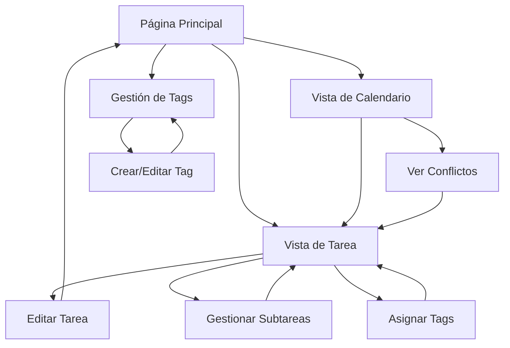

# TaskMaster 1.5 - Requerimientos del Producto

## 1. Visión General del Producto

TaskMaster 1.5 es una aplicación de gestión de tareas simplificada que permite crear, organizar y gestionar tareas y subtareas sin la complejidad de un sistema de usuarios. Se enfoca en funcionalidades core probadas y estables antes de agregar características avanzadas.

- **Objetivo Principal**: Validar y perfeccionar las funcionalidades básicas de gestión de tareas sin autenticación
- **Enfoque**: Implementación por fases, comenzando con lo esencial y agregando complejidad gradualmente
- **Valor**: Aplicación robusta y confiable que sirve como base sólida para futuras expansiones

## 2. Funcionalidades Core

### 2.1 Roles de Usuario
**NO APLICA EN FASE 1-3** - La aplicación funcionará sin sistema de usuarios, todas las tareas se almacenan localmente sin autenticación.

### 2.2 Módulos de Funcionalidades

Nuestra aplicación TaskMaster 1.5 consiste en las siguientes páginas principales:

1. **Página Principal**: Lista de tareas, filtros básicos, creación rápida de tareas
2. **Vista de Tarea**: Detalles completos, edición, gestión de subtareas y tags
3. **Vista de Calendario**: Visualización de tareas por fechas, detección de conflictos
4. **Gestión de Tags**: Creación, edición y organización de etiquetas

### 2.3 Detalles de Páginas

| Página | Módulo | Descripción de Funcionalidad |
|--------|--------|------------------------------|
| Página Principal | Lista de Tareas | Mostrar todas las tareas con filtros por estado, prioridad y tags. Crear tareas rápidamente |
| Página Principal | Barra de Filtros | Filtrar por completado/pendiente, prioridad, tags, fechas |
| Página Principal | Estadísticas Básicas | Contador de tareas pendientes, completadas, vencidas |
| Vista de Tarea | Formulario de Edición | Editar título, descripción, fechas, prioridad, tags |
| Vista de Tarea | Gestión de Subtareas | Crear, editar, eliminar, reordenar subtareas |
| Vista de Tarea | Asignación de Tags | Seleccionar múltiples tags, crear nuevos tags |
| Vista de Tarea | Detección de Conflictos | Mostrar alertas de conflictos de fechas automáticamente |
| Vista de Calendario | Calendario Mensual | Visualizar tareas por día, navegación por meses |
| Vista de Calendario | Alertas de Conflictos | Resaltar días con conflictos, mostrar detalles |
| Gestión de Tags | CRUD de Tags | Crear, editar, eliminar tags con colores personalizados |
| Gestión de Tags | Vista de Uso | Mostrar cuántas tareas usan cada tag |

## 3. Proceso Core

### Flujo Principal de Usuario

1. **Creación de Tarea**: Usuario accede a la página principal → Clic en "Nueva Tarea" → Completa formulario básico → Guarda tarea
2. **Gestión de Subtareas**: Usuario selecciona tarea → Accede a vista detallada → Agrega subtareas → Marca como completadas
3. **Asignación de Tags**: Usuario en vista de tarea → Selecciona tags existentes o crea nuevos → Aplica tags
4. **Resolución de Conflictos**: Sistema detecta conflictos automáticamente → Muestra alertas → Usuario ajusta fechas
5. **Vista de Calendario**: Usuario accede al calendario → Visualiza tareas por fecha → Identifica conflictos visualmente

### Diagrama de Navegación

## 4. Diseño de Interfaz de Usuario

### 4.1 Estilo de Diseño

- **Colores Primarios**: 
  - Azul principal: `#3B82F6` (botones primarios, enlaces)
  - Verde éxito: `#10B981` (tareas completadas, confirmaciones)
  - Rojo alerta: `#EF4444` (conflictos, eliminaciones)
  - Amarillo advertencia: `#F59E0B` (tareas vencidas, alertas)
  - Gris neutro: `#6B7280` (texto secundario, bordes)

- **Estilo de Botones**: Redondeados (rounded-lg), con sombras sutiles, estados hover claros
- **Tipografía**: Inter como fuente principal, tamaños 14px (texto), 16px (botones), 24px (títulos)
- **Layout**: Diseño de tarjetas con espaciado generoso, navegación superior fija
- **Iconografía**: Lucide React icons, estilo minimalista y consistente

### 4.2 Resumen de Diseño de Páginas

| Página | Módulo | Elementos UI |
|--------|--------|-------------|
| Página Principal | Header | Logo, título, botón "Nueva Tarea", filtros rápidos |
| Página Principal | Lista de Tareas | Tarjetas de tarea con checkbox, título, tags, fecha, prioridad |
| Página Principal | Sidebar de Filtros | Filtros por estado, prioridad, tags, rango de fechas |
| Vista de Tarea | Formulario Principal | Campos de texto, selectores de fecha, dropdown de prioridad |
| Vista de Tarea | Sección de Tags | Chips de tags seleccionados, input para agregar nuevos |
| Vista de Tarea | Lista de Subtareas | Lista ordenable con checkboxes, botón "Agregar Subtarea" |
| Vista de Calendario | Calendario | Grid mensual con indicadores de tareas, colores por prioridad |
| Vista de Calendario | Panel de Conflictos | Lista de conflictos detectados con severidad y sugerencias |
| Gestión de Tags | Lista de Tags | Tarjetas de tags con color, nombre, contador de uso, acciones |

### 4.3 Responsividad

- **Enfoque**: Desktop-first con adaptación móvil
- **Breakpoints**: 
  - Desktop: 1024px+
  - Tablet: 768px - 1023px
  - Móvil: 320px - 767px
- **Adaptaciones Móviles**:
  - Navegación colapsable
  - Filtros en modal/drawer
  - Tarjetas de tarea apiladas
  - Calendario con vista semanal en móvil

## 5. Funcionalidades Específicas por Fase

### Fase 1: Funcionalidades Básicas (SIN Usuarios)
- ✅ **Tareas**: Crear, editar, eliminar, marcar como completada
- ✅ **Subtareas**: Jerarquía de tareas anidadas
- ✅ **Tags**: Sistema de etiquetado con colores
- ✅ **Prioridades**: LOW, MEDIUM, HIGH, URGENT
- ✅ **Fechas**: Fecha de vencimiento y fecha de inicio
- ✅ **Persistencia**: Almacenamiento local en SQLite
- ✅ **Interfaz**: Lista de tareas responsive y intuitiva

### Fase 2: Gestión de Conflictos
- ✅ **Detección Automática**: Conflictos de fechas superpuestas
- ✅ **Alertas Visuales**: Indicadores de conflictos en UI
- ✅ **Vista de Calendario**: Visualización mensual de tareas
- ✅ **Sugerencias**: Recomendaciones para resolver conflictos

### Fase 3: Logs y Actividades
- ✅ **Historial de Cambios**: Log de todas las modificaciones
- ✅ **Dashboard de Actividades**: Vista de actividades recientes
- ✅ **Filtros de Logs**: Por fecha, tipo de acción, tarea
- ✅ **Exportación**: Reportes básicos en JSON/CSV

### Fase 4: Sistema de Usuarios (OPCIONAL)
- 🔄 **Autenticación**: Login/registro básico
- 🔄 **Migración de Datos**: Asignar tareas existentes a usuarios
- 🔄 **Control de Acceso**: Tareas privadas por usuario
- 🔄 **Compartir**: Funcionalidad básica de compartir tareas

## 6. Criterios de Aceptación

### Fase 1 - Criterios Mínimos
- [ ] Crear tarea con título, descripción, fecha, prioridad
- [ ] Editar todos los campos de una tarea
- [ ] Eliminar tareas con confirmación
- [ ] Crear y gestionar subtareas
- [ ] Asignar múltiples tags a tareas
- [ ] Crear, editar, eliminar tags
- [ ] Filtrar tareas por estado, prioridad, tags
- [ ] Marcar tareas y subtareas como completadas
- [ ] Persistencia de datos entre sesiones
- [ ] Interfaz responsive en desktop y móvil

### Fase 2 - Criterios de Conflictos
- [ ] Detectar automáticamente conflictos de fechas
- [ ] Mostrar alertas visuales de conflictos
- [ ] Vista de calendario funcional
- [ ] Sugerencias para resolver conflictos

### Fase 3 - Criterios de Logs
- [ ] Registrar todas las acciones de usuario
- [ ] Dashboard de actividades recientes
- [ ] Filtros funcionales en logs
- [ ] Exportación básica de datos

## 7. Limitaciones y Exclusiones

### No Incluido en Versión 1.5
- ❌ **Sistema de Usuarios**: Sin autenticación ni perfiles
- ❌ **Modo Compacto**: Solo una versión de interfaz
- ❌ **Colaboración**: Sin compartir tareas entre usuarios
- ❌ **Notificaciones**: Sin alertas push o email
- ❌ **Sincronización**: Sin backup en la nube
- ❌ **Temas**: Solo tema claro por defecto
- ❌ **Plugins**: Sin extensibilidad de terceros

### Simplificaciones Técnicas
- **Base de Datos**: SQLite local (no PostgreSQL)
- **Autenticación**: Ninguna (datos locales)
- **APIs Externas**: Ninguna integración
- **Deployment**: Solo desarrollo local

Esta versión simplificada permite validar las funcionalidades core antes de agregar complejidad adicional.