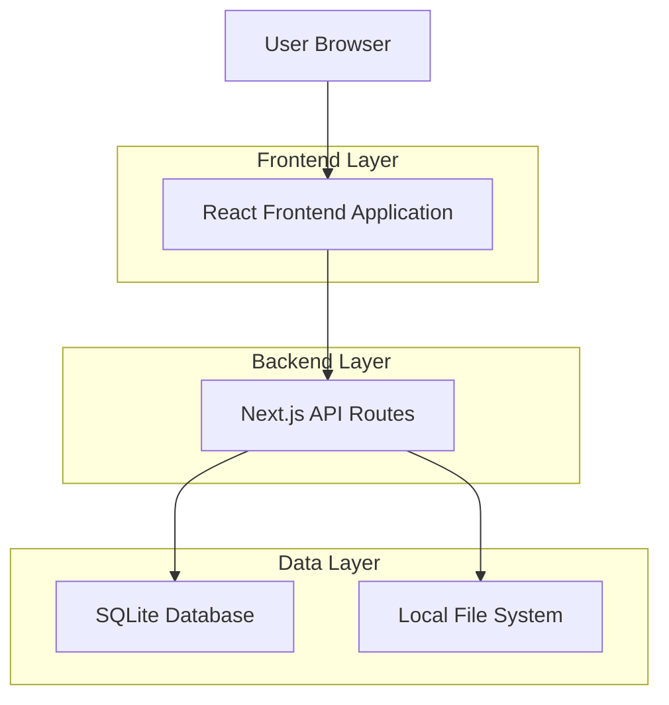
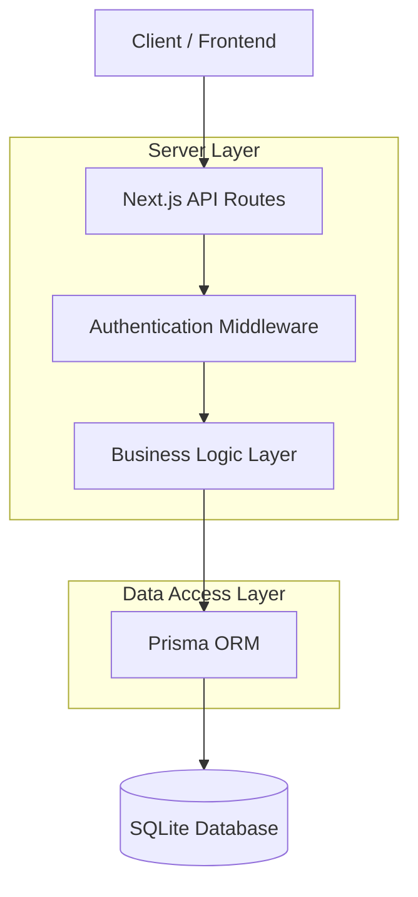
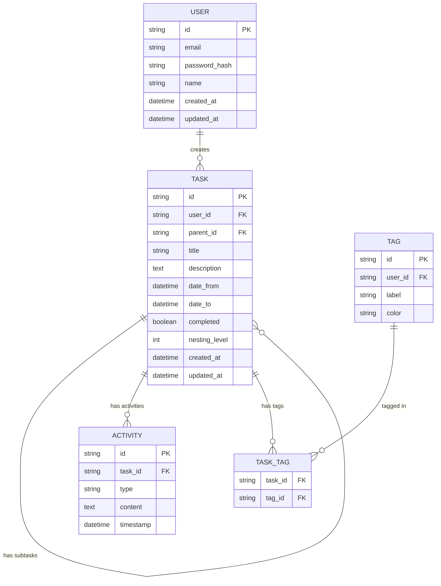

## 1. Architecture design



## 2. Technology Description

* Frontend: React\@18 + Next.js\@15 + TypeScript\@5 + Tailwind CSS\@3

* Backend: Next.js API Routes + Prisma ORM

* Database: SQLite (desarrollo) / PostgreSQL (producción)

* Authentication: NextAuth.js con provider de credenciales

* UI Components: Radix UI + Shadcn/ui

* Form Handling: React Hook Form + Zod validation

* Date Management: date-fns

* Icons: Lucide React

## 3. Route definitions

| Route                       | Purpose                                              |
| --------------------------- | ---------------------------------------------------- |
| /auth/login                 | Página de inicio de sesión con email y contraseña    |
| /auth/register              | Página de registro de nuevos usuarios                |
| /auth/forgot-password       | Página de recuperación de contraseña                 |
| /                           | Dashboard principal con lista de tareas y calendario |
| /task/\[id]                 | Vista detallada de tarea individual con subtareas    |
| /calendar                   | Vista de calendario dedicada                         |
| /api/auth/\[...nextauth]    | Endpoints de autenticación de NextAuth.js            |
| /api/tasks                  | CRUD operations para tareas                          |
| /api/tasks/\[id]/subtasks   | Gestión de subtareas                                 |
| /api/tasks/\[id]/activities | Historial de actividades                             |

## 4. API definitions

### 4.1 Core API

**Autenticación de usuarios**

```
POST /api/auth/signin
```

Request:

| Param Name | Param Type | isRequired | Description            |
| ---------- | ---------- | ---------- | ---------------------- |
| email      | string     | true       | Email del usuario      |
| password   | string     | true       | Contraseña del usuario |

Response:

| Param Name | Param Type | Description                         |
| ---------- | ---------- | ----------------------------------- |
| user       | object     | Información del usuario autenticado |
| token      | string     | Token de sesión                     |

**Gestión de tareas**

```
GET /api/tasks
```

Response:

| Param Name | Param Type | Description                 |
| ---------- | ---------- | --------------------------- |
| tasks      | Task\[]    | Array de tareas del usuario |

```
POST /api/tasks
```

Request:

| Param Name  | Param Type | isRequired | Description                |
| ----------- | ---------- | ---------- | -------------------------- |
| title       | string     | true       | Título de la tarea         |
| description | string     | false      | Descripción de la tarea    |
| dateRange   | object     | false      | Rango de fechas {from, to} |
| tags        | string\[]  | false      | Array de etiquetas         |

**Gestión de subtareas**

```
POST /api/tasks/[id]/subtasks
```

Request:

| Param Name  | Param Type | isRequired | Description                |
| ----------- | ---------- | ---------- | -------------------------- |
| title       | string     | true       | Título de la subtarea      |
| description | string     | false      | Descripción de la subtarea |
| dateRange   | object     | false      | Rango de fechas            |
| parentId    | string     | true       | ID de la tarea padre       |

**Historial de actividades**

```
GET /api/tasks/[id]/activities
```

Response:

| Param Name | Param Type  | Description                      |
| ---------- | ----------- | -------------------------------- |
| activities | Activity\[] | Array de actividades de la tarea |

```
POST /api/tasks/[id]/activities
```

Request:

| Param Name | Param Type | isRequired | Description                |
| ---------- | ---------- | ---------- | -------------------------- |
| type       | string     | true       | Tipo: 'comment' o 'log'    |
| content    | string     | true       | Contenido de la actividad  |
| taskId     | string     | true       | ID de la tarea relacionada |

## 5. Server architecture diagram



## 6. Data model

### 6.1 Data model definition



### 6.2 Data Definition Language

**Tabla de usuarios (users)**

```sql
-- create table
CREATE TABLE users (
    id TEXT PRIMARY KEY DEFAULT (lower(hex(randomblob(16)))),
    email TEXT UNIQUE NOT NULL,
    password_hash TEXT NOT NULL,
    name TEXT NOT NULL,
    created_at DATETIME DEFAULT CURRENT_TIMESTAMP,
    updated_at DATETIME DEFAULT CURRENT_TIMESTAMP
);

-- create index
CREATE INDEX idx_users_email ON users(email);
```

**Tabla de tareas (tasks)**

```sql
-- create table
CREATE TABLE tasks (
    id TEXT PRIMARY KEY DEFAULT (lower(hex(randomblob(16)))),
    user_id TEXT NOT NULL,
    parent_id TEXT,
    title TEXT NOT NULL,
    description TEXT,
    date_from DATETIME,
    date_to DATETIME,
    completed BOOLEAN DEFAULT FALSE,
    nesting_level INTEGER DEFAULT 0,
    created_at DATETIME DEFAULT CURRENT_TIMESTAMP,
    updated_at DATETIME DEFAULT CURRENT_TIMESTAMP,
    FOREIGN KEY (user_id) REFERENCES users(id) ON DELETE CASCADE,
    FOREIGN KEY (parent_id) REFERENCES tasks(id) ON DELETE CASCADE,
    CHECK (nesting_level <= 2)
);

-- create indexes
CREATE INDEX idx_tasks_user_id ON tasks(user_id);
CREATE INDEX idx_tasks_parent_id ON tasks(parent_id);
CREATE INDEX idx_tasks_date_from ON tasks(date_from);
CREATE INDEX idx_tasks_date_to ON tasks(date_to);
```

**Tabla de actividades (activities)**

```sql
-- create table
CREATE TABLE activities (
    id TEXT PRIMARY KEY DEFAULT (lower(hex(randomblob(16)))),
    task_id TEXT NOT NULL,
    type TEXT NOT NULL CHECK (type IN ('comment', 'log')),
    content TEXT NOT NULL,
    timestamp DATETIME DEFAULT CURRENT_TIMESTAMP,
    FOREIGN KEY (task_id) REFERENCES tasks(id) ON DELETE CASCADE
);

-- create index
CREATE INDEX idx_activities_task_id ON activities(task_id);
CREATE INDEX idx_activities_timestamp ON activities(timestamp DESC);
```

**Tabla de etiquetas (tags)**

```sql
-- create table
CREATE TABLE tags (
    id TEXT PRIMARY KEY DEFAULT (lower(hex(randomblob(16)))),
    user_id TEXT NOT NULL,
    label TEXT NOT NULL,
    color TEXT NOT NULL,
    FOREIGN KEY (user_id) REFERENCES users(id) ON DELETE CASCADE
);

-- create index
CREATE INDEX idx_tags_user_id ON tags(user_id);
```

**Tabla de relación tarea-etiqueta (task\_tags)**

```sql
-- create table
CREATE TABLE task_tags (
    task_id TEXT NOT NULL,
    tag_id TEXT NOT NULL,
    PRIMARY KEY (task_id, tag_id),
    FOREIGN KEY (task_id) REFERENCES tasks(id) ON DELETE CASCADE,
    FOREIGN KEY (tag_id) REFERENCES tags(id) ON DELETE CASCADE
);
```

**Datos iniciales**

```sql
-- Etiquetas predeterminadas para nuevos usuarios
INSERT INTO tags (user_id, label, color) VALUES 
('user_id_placeholder', 'Trabajo', '#3B82F6'),
('user_id_placeholder', 'Personal', '#10B981'),
('user_id_placeholder', 'Urgente', '#EF4444'),
('user_id_placeholder', 'Proyecto', '#8B5CF6');
```

